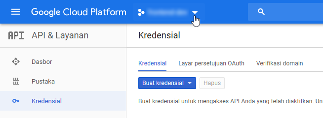

# Laravel 5.4.* Login with Google
[](https://david-dm.org/dhanyn10/laravel-google-login?type=dev)
[](https://badge.fury.io/gh/dhanyn10%2Flaravel-google-login)
  
This repo already installed required dependencies:
1. [Google API php client](https://github.com/google/google-api-php-client)  
2. [Guzzle](https://github.com/guzzle/guzzle)  
--------------------------------------------------
## Google Console API Configuration
__I assume that you already understand about how to configure your own laravel project.__  
--------------------------------------------------
If you dont have Project in Google Console API that can be connected to this *laravel google login*, then you need to create a project. Here's the tutorial:  
1. Go to Google Console API page
2. Click to project  

3. Create new project  


Skip above steps if you already created a project  
--------------------------------------------------
Make sure you've configured ```CLIENT_ID```, ```CLIENT_SECRET```, ```API_KEY/DEVELOPER_KEY```,
and ```URI_REDIRECT```.  
Location : ```app/Http/Controllers/UserController.php```.
These configuration can be found at Google Console API
1. for ```API_KEY/DEVELOPER_KEY```  
  
2. for ```CLIENT_ID``` and ```CLIENT_SECRET```  
  
3. for ```URI_REDIRECT```  
  
--------------------------------------------------
## Other Configuration  
Fix problem [cacert](http://stackoverflow.com/questions/30240840/laravel-5-socialite-curl-error-77-error-setting-certificate-verify-locations)  
1. Download file [cacert.pem](https://curl.haxx.se/ca/cacert.pem)  
2. Save as ```cacert.pem.txt``` to ```C:/xampp/php/```  
3. Open php ini  
  
4. Search ```php.ini Options```  add new line ```curl.cainfo = "C:\xampp\php\cacert.pem.txt"``` and save  

